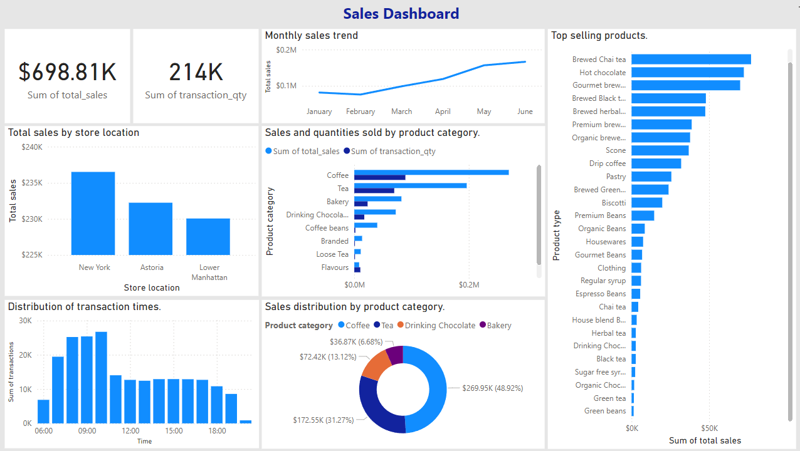

# Sales-Dashboard
The Objective of this project is to perform a comprehensive analysis of the sales data from a coffee shop chain to derive actionable insights that can inform business strategies and enhance operational efficiency. This analysis aims to identify key revenue drivers, understand customer purchasing behavior, evaluate store performance.

## Tools Used
- **Excel**: Data cleaning and preparation
- **Power BI**: Data visualization and dashboard creation

## Steps
## 1. **Data Collection**: 
The dataset used in this project was collected from Kaggle and contains detailed transaction data from a coffee shop. This dataset provides a comprehensive view of sales performance, including various attributes of each transaction. Below are the columns included in the dataset:

- **transaction_id** : A unique identifier for each transaction.
- **transaction_date** : The date of the transaction.
- **transaction_time** : The time of the transaction.
- **transaction_qty** : The quantity of items purchased in the transaction.
- **store_id** : A unique identifier for each store.
- **store_location** : The location of the store where the transaction took place.
- **product_id** : A unique identifier for each product.
- **unit_price** : The price per unit of the product.
- **product_category** : The category of the product.
- **product_type** : The type of product within the category.
- **product_detail** : Additional details about the product.

## 2. **Data Cleaning and Preparation**:
Before analyzing the data and creating visualizations, it is essential to clean and prepare the dataset to ensure accuracy and reliability. This section outlines the steps taken to clean and prepare the data using Excel and Power Query.

### **2.1 Handling Missing Values:** 
Missing values can skew the analysis and lead to incorrect conclusions. Addressing missing values appropriately is crucial for data integrity Missing values were identified using Power Query. Once identified different strategies were used depending on the column type: For numerical columns such as `transaction_qty` and `unit_price`, missing values were filled with the mean of the respective columns. For categorical columns such as `product_category`, `product_type`, and `product_detail`, missing values were filled with the mode to maintain consistency.

**2.2 Data Validation and Correction:**
Ensuring that each column has the correct data type is crucial for accurate analysis. The data types were validated and corrected:
- **Date Columns**: The `transaction_date` column was converted to a Date type to enable date-based analysis.
- **Time Columns**: The `transaction_time` column was converted to a Time type to facilitate time-based analysis.
- **Numerical Columns**: Columns such as `transaction_id`, `transaction_qty`, `store_id`, and `product_id` were validated as integers, while `unit_price` was 
  validated as a decimal number to ensure precise calculations.
- **Categorical Columns**: Columns such as `store_location`, `product_category`, `product_type`, and `product_detail` were validated as text to maintain data consistency.

<!-- Blank line -->
**2.3 Removing Duplicate Values :** 
Duplicate records can lead to inaccurate analysis and biased results. The dataset was checked for duplicates and any duplicate rows were removed to ensure data quality:

<!-- Blank line -->
**2.4 Creating New Columns:**
To enhance the analysis, new calculated columns were added. These columns provide additional insights and facilitate more detailed analysis:
**Total Sales**: A new column `total_sales` was created by multiplying `transaction_qty` by `unit_price`. This column represents the total revenue generated from each transaction.

<!-- Blank line -->
2.5. Data Validation:
Data validation was done to ensur that numerical values were within expected ranges, categorical values were consistent, and date/time values were correctly formatted. These checks helped ensure the data's accuracy and reliability.

## **3.Creationg dashboard:**
   Imported cleaned data into Power BI, ensured correct table relationships, and created the analysis dashboard.
   

   

